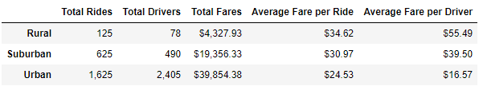
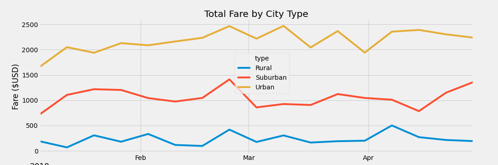

# PyBer_Analysis

## Overview of the analysis

The goal of this project is to analyze the ride-sharing data in urban, suburban, and rural cities in order to help PyBer make informed business decisions. 

## Results

As can bee seen in the table below, there is a significant difference in the number of drivers in the three types of cities. Urban cities had the most drivers in 2019 which was 2405. The numbers of suburban and rural drivers are merely about 20% and 3% of that number. The total number of rides in urban, suburban, and rural cities, are 1625, 625, and 125, respectively. This means that, despite fewer drivers in rural and suburban areas, drivers in these cities took more passengers than those in urban cities on average. 

From the graph below, we can see that the total amount of fares from urban cities was almost forty thousand dollars, which is approximately two times of the amount from suburban cities and ten times of the amount from rural cities. 

On average, share-riding as the most expensive in rural areas, which suburban cities being the second and urban cities being the cheapest. 
Drivers in rural cities also ranked the highest in the amount of fares collected on average. The average fare per driver is the lowest in urban cities ($16.57), less than a half of that in suburban cities ($39.50).

## Summary

Here are three recommendations to help mitigate the disparities among the city types.
More actions should be taken to help attract more drivers in the rural and suburban cities. From the analysis we can see that, in 2019, the ratios of driver to ride in rural and suburban were much smaller than the ratio in urban cities. Increasing the number of drivers will help reduce the fare per ride, which will attract more customers. 

There were too many drivers in the urban cities. The supply for share-riding was higher than the demand in these areas, which lowered the average fare per driver. Fewer drivers should be motivated to join share-riding business in these cities. 

The average fare per ride in rural cities were highest, probably because the distance per trip was greater than the one in the other two areas. However, since there is less traffic in rural areas, it is suggested to lower fare rate by reducing the cut by the company to make share-riding more accessible for customers.
